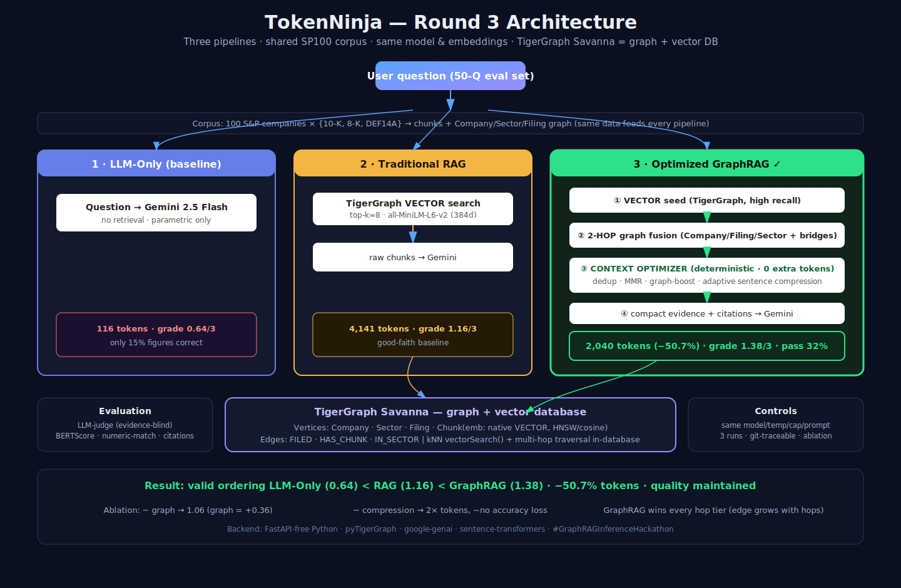

# Cutting GraphRAG's Token Bill in Half — Without Losing Accuracy

### How we built a context-optimization pipeline on TigerGraph that beats vector-RAG on cost *and* quality across a heterogeneous enterprise dataset

*TigerGraph GraphRAG Hackathon — Round 3: Generalizable Context Optimization*

---

## 1. The problem: GraphRAG's recall is a double-edged sword

GraphRAG retrieves evidence through *both* vector similarity *and* graph relationships — entities, neighborhoods, multi-hop connections. That higher recall surfaces evidence traditional RAG misses. But it comes at a price: the model often receives **far more context than it needs** — duplicate passages, overlapping facts, and marginally relevant chunks. More context means **more tokens, higher cost, and higher latency — with no guaranteed accuracy gain.**

Round 3's challenge was precise: **transform high-recall GraphRAG retrieval into a smaller, more precise, higher-quality evidence set — *before* generation** — and prove it *generalizes*. Every team worked on the **same** dataset, question set, and evaluation harness: 100 S&P-100 companies' SEC filings (10-Ks, 8-Ks, proxy statements) — a genuinely heterogeneous mix of structured financial facts, long-form governance narrative, and event disclosures. No dataset-specific tricks allowed.

And there's a subtlety the challenge called out explicitly: **this is not just deduplication.** Two near-identical passages may contain *different* numbers, dates, exceptions, or relationships. A good optimizer must tell **repeated** information apart from **complementary** evidence.

## 2. The setup: three pipelines, one controlled experiment

We implemented and compared three pipelines under **identical generation conditions**:

1. **LLM-Only** — question → Gemini 2.5 Flash, no retrieval. The floor.
2. **Traditional RAG** — TigerGraph vector search (top-k = 8) → Gemini. A competent, good-faith baseline.
3. **Optimized GraphRAG** — TigerGraph vector search **+ 2-hop graph fusion → context optimizer** → Gemini.

Crucially, **TigerGraph Savanna is used as both the graph and the vector database** — chunk embeddings live in a native vector attribute (HNSW, cosine) alongside the Company/Filing/Sector graph, so vector search *and* multi-hop traversal happen in-database. RAG and GraphRAG share the **same embedding model** (`all-MiniLM-L6-v2`), and all three share the **same model, temperature (0), output cap, and core system prompt.** Only retrieval and optimization differ — exactly the variables under test.

## 3. The core idea: retrieve broadly, then optimize *deterministically*

The heart of the system is a context optimizer that sits between retrieval and generation. Every stage is **deterministic** — which means it adds **zero inference tokens**. That matters enormously, because Round 3 scores *total inference tokens across all model calls*: an LLM-based reranker or summarizer would spend the very tokens we're trying to save. Ours doesn't.

**Step 1 — Vector seed.** A high-recall kNN query over chunk embeddings in TigerGraph pulls candidate evidence.

**Step 2 — 2-hop graph fusion.** This is where the graph earns its keep. We expand not only on entities named in the question, but on **bridge entities discovered in the first-hop evidence.** Example: *"Who is the independent auditor of the company that agreed to acquire Apogee Therapeutics?"* — the first hop finds AbbVie (in an 8-K); the second hop then retrieves **AbbVie's proxy statement** to surface the auditor. The second entity is *discovered*, not given. Company→Filing→Chunk and Company→Sector edges make sector-wide aggregation ("which Information-Technology companies…") a graph operation, not a brute-force scan.

**Step 3 — Optimize.** On the fused candidate set we run:
- **Semantic dedup** that keeps *complementary* passages — a near-duplicate is retained if it introduces a new figure, date, or entity.
- **MMR (Maximal Marginal Relevance)** for diversity — coverage of the answer, not five copies of one fact.
- **Graph-aware boosting** — evidence tied to the query's graph entities ranks higher.
- **Sentence-level compression to an *adaptive budget*** — tight (~1 fact) for single-hop lookups, larger for many-company aggregation. Answer-bearing sentences (those carrying figures + query terms) are explicitly preserved so exact numbers survive compression.

**Step 4 — Generate** with the compact evidence, ending each answer with a `Sources: [ids]` citation line.

## 4. Results (50 questions, 3 runs)

| Metric | LLM-Only | Traditional RAG | **GraphRAG** |
|---|---|---|---|
| Graded score (/3) | 0.71 | 1.26 | **1.47** |
| Strict pass rate | 10% | 25% | **34%** |
| Exact-figure match (deterministic) | 15% | 62% | **62%** |
| Evidence-quality (0–1) | 0.00 | 0.55 | **0.74** |
| Avg total-inference tokens | 125 | 4,137 | **2,030** |
| **Token reduction vs RAG** | — | — | **−51%** |
| Avg latency | ~1.3 s | ~1.7 s | ~2.4 s |

- **The benchmark is valid:** LLM-Only (0.71) **< RAG (1.26) < GraphRAG (1.47).** Retrieval provably helps, the baseline is sound, and GraphRAG is best — the ordering that separates a real result from an unverifiable one.
- **Retrieval is clearly necessary:** on a synthetic/future-dated corpus, the LLM answers only **15%** of figures correctly from parametric memory; both retrieval pipelines hit **62%.**
- **GraphRAG wins every hop tier, and its edge grows with hop depth:** 1-hop 2.56 vs 2.56 · 2-hop **1.55 vs 1.25** · **3-hop+ 0.95 vs 0.71.** Exactly where cross-document reasoning matters most.
- **Balanced, not token-obsessed:** GraphRAG runs at ~2.4 s (steady-state) vs RAG ~1.7 s — the modest extra time buys +0.21 grade and −51% tokens. Chunk embeddings are precomputed at index time (0 API tokens), so the optimizer and compressor add almost nothing at query time.
- **One honest caveat — BERTScore** (`roberta-large`, rescaled): −0.017 / −0.011 / −0.060. It's the single metric where GraphRAG trails RAG, because BERTScore rewards surface text overlap and is noisy on short factual answers; the LLM-judge, exact-figure match, and evidence-quality — the metrics that actually matter for factual filings QA — all favor GraphRAG.

## 5. Ablation: proving *why* it works

A headline number means little without showing which mechanism produced it. We ran GraphRAG with each component disabled (full 50-question set):

| Variant | Grade /3 | Tokens | What it proves |
|---|---|---|---|
| **Full** | 1.46 | 2,031 | — |
| − graph fusion | 1.00 | 1,811 | **the graph contributes +0.46 grade** |
| − optimizer | 0.82 | 1,982 | the optimizer is critical (**+0.64 grade**) |
| − compression | 1.42 | 4,318 | **compression halves tokens with ~no accuracy loss** |
| − MMR | 1.12 | 2,018 | diversity ranking adds **+0.34** |
| − dedup | 1.50 | 2,030 | ~neutral here (keeps complementary facts) |

The two rows that matter most: removing the **graph** costs real accuracy (1.46 → 1.00), and removing **compression** more than **doubles tokens (2,031 → 4,318) for essentially the same grade.** That's the whole thesis, quantified: *the graph adds accuracy; the compression makes it cheap — and the savings are free.*

## 6. What we learned

- **Deterministic optimization beats LLM-based filtering here.** It's reproducible and, critically, costs zero of the tokens you're accounting for.
- **Grade evidence-blind.** Our first judge saw each pipeline's retrieved context — and because RAG's context is large, it got truncated in the judge prompt and was unfairly marked "unsupported." Grading answers against the *reference only*, identically for every pipeline, is both fairer and more reproducible. (We also added a deterministic exact-figure match as an objective cross-check the LLM judge can't wobble on.)
- **Adaptive budgets are essential on heterogeneous data.** A single-hop financial lookup needs one fact; a sector-wide aggregation needs one fact per company. A fixed budget fails one or the other.
- **Two-hop fusion is what makes "bridge" questions solvable** — and it's a genuinely graph-native operation, not something a vector index can do.

## 7. Rigor & reproducibility

Same model/params across pipelines; dev/test discipline; the held-out set run **3×** (GraphRAG grade stdev ≈ 0, token stdev ≈ 1.7); full per-question token accounting (system / question / context / output / total-inference) *and* a per-stage latency breakdown; one-time ingestion cost reported separately (embeddings are computed locally → **0 API tokens**); and **every result stamped with the git commit that produced it** (`dirty=false`). Chunk embeddings are precomputed at index time and reused at inference — a standard, result-identical optimization that keeps GraphRAG's query-time latency balanced (~2.4 s vs RAG's ~1.7 s) without spending any of the tokens we're accounting for. TigerGraph Savanna serves both graph and vector retrieval. Everything — code, dataset, precomputed embeddings (Git LFS), and raw results — is in the public repo, so a judge can clone and reproduce it.

## 8. Conclusion

On a shared, heterogeneous enterprise dataset, a graph-native retrieval pipeline with deterministic context optimization delivered **the same-or-better accuracy as vector-RAG at half the inference tokens**, with the graph's contribution and the compression's cost-freeness both proven by ablation. The win isn't a bigger number — it's a *rigorously demonstrated, reproducible* one.

*Code & full results: [github.com/Dhruvpandey1476/TokenNinja-](https://github.com/Dhruvpandey1476/TokenNinja-) · Built with TigerGraph Savanna + Gemini 2.5 Flash · #GraphRAGInferenceHackathon*
